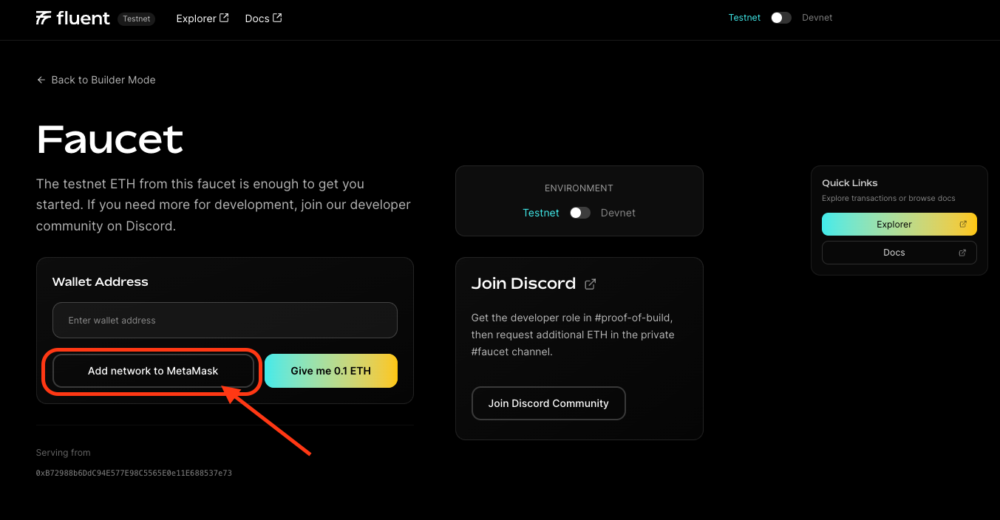

Connect to Fluent
---

Fluent, the blended execution network, is now on testnet. Fluent and the Fluentbase SDK are explicitly designed for deploying and interacting with EVM and Rust-based smart contracts. Solidity and Rust contracts can be deployed independently, or call each other as part of a [blended application](./developer-guides/building-a-blended-app/README.md) that utilizes both types of contracts.

Devnet (Fluent Developer Preview) will also remain available to developers with slightly different service levels (see the dedicated sections below for more info).

## Quickstart Wallet Connect

To quickly integrate Fluent with your wallet, visit the [Fluent Developer Portal](https://testnet.fluent.xyz/dev-portal) and add network info:
 

Or add manually with the network info you find below.

<!-- To quickly integrate Fluent with your wallet, use one of these 1-click options:

<table data-column-title-hidden data-view="cards">
    <tbody>
        <tr>
            <td>
                <a href="https://chainlist.org/?testnets=true&search=fluent">
                    <strong>Chainlist</strong> 
                    Add network info to your wallet directly from Chainlist.
                </a>
            </td>
            <td>
                <a href="https://testnet.fluent.xyz/dev-portal/">
                    <strong>Fluent Dev Portal</strong>
                    Add network info to your wallet from Fluent dev portal.
                </a>
            </td>
        </tr>
    </tbody>
</table>

        <a href="https://chainlist.org/?testnets=true&search=fluent">
            <strong>Chainlist</strong> 
            Add network info to your wallet directly from Chainlist.
        </a>
        <a href="https://testnet.fluent.xyz/dev-portal">
            <strong>Fluent Dev Portal</strong>
            Add network info to your wallet from Fluent dev portal.
        </a>

 -->

## Fluent Testnet

:::warning

The Fluent Testnet is more stable than Devnet, but it is still under active development and may experience occasional resets or downtime. While less frequent, network changes can still result in the loss of deployed contracts and data. Please use Testnet for development and testing only—do not rely on it for production use.

:::

### Network Parameters

<table><tbody><tr><td><strong class="row-name">Network Name:</strong></td><td>Fluent Testnet</td></tr>
<tr><td><strong class="row-name">HTTPS RPC URL:</strong></td><td>https://rpc.testnet.fluent.xyz/</td></tr>
<tr><td><strong class="row-name">Chain ID:</strong></td><td>20994</td></tr>
<tr><td><strong class="row-name">Symbol:</strong></td><td>ETH</td></tr>
<tr><td><strong class="row-name">Explorer:</strong></td><td><a href="https://testnet.fluentscan.xyz/">https://testnet.fluentscan.xyz/</a></td></tr></tbody></table>

### Network Resources

<table>
<tbody><tr><td><strong class="row-name">Faucet:</strong></td><td><a href="https://testnet.fluent.xyz/dev-portal"> https://testnet.fluent.xyz/dev-portal</a></td></tr>
<tr><td><strong class="row-name">Websocket RPC URL:</strong></td><td>wss://rpc.testnet.fluent.xyz/ws</td></tr></tbody>
</table>

## Fluent Devnet

:::danger

The Fluent Devnet is experimental and may be reset at any time to apply upgrades or improve stability. Please be aware that network resets can result in the loss of deployed contracts and data.

:::

### Network Parameters

<table><tbody><tr><td><strong class="row-name">Network Name:</strong></td><td>Fluent Developer Preview</td></tr>
<tr><td><strong class="row-name">HTTPS RPC URL:</strong></td><td>https://rpc.devnet.fluent.xyz/</td></tr>
<tr><td><strong class="row-name">Chain ID:</strong></td><td>20993</td></tr>
<tr><td><strong class="row-name">Symbol:</strong></td><td>ETH</td></tr>
<tr><td><strong class="row-name">Explorer:</strong></td><td><a href="https://devnet.fluentscan.xyz/">https://devnet.fluentscan.xyz/</a></td></tr></tbody></table>

### Network Resources

<table>
<tbody><tr><td><strong class="row-name">Faucet:</strong></td><td><a href="https://testnet.fluent.xyz/dev-portal">https://testnet.fluent.xyz/dev-portal</a></td></tr>
<tr><td><strong class="row-name">Websocket RPC URL:</strong></td><td>wss://rpc.dev.gblend.xyz/ws</td></tr></tbody>
</table>

### Current Features and Limitations (Devnet)

In this version, the offering includes a basic Reth implementation, where the execution environment is substituted with Fluent's VM, rWasm. Rollup and zk functionalities are not available at this stage.

It's essential to note that significant changes might occur in the VM structure, host SDK, and execution layer in subsequent releases.
